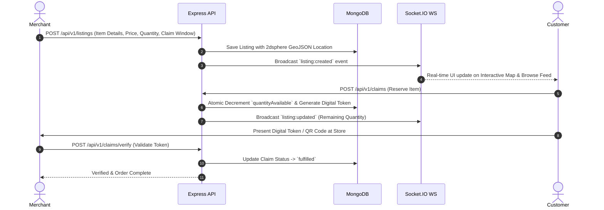
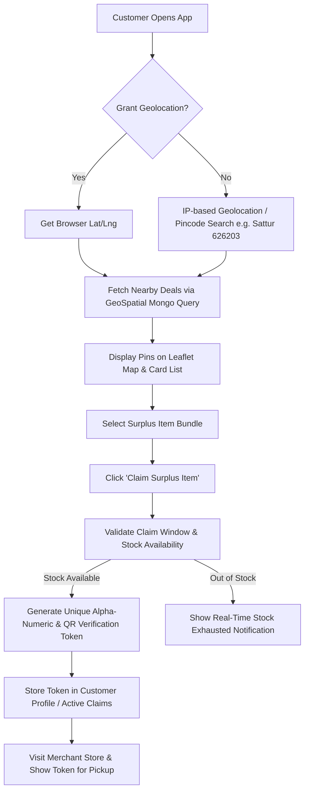

# FlashYield — Hyper-Local Surplus Food Marketplace

> **Direct-Connect Marketplace Eliminating Food Waste with Real-Time Deals & Verified Digital Tokens.**

---

## Executive Summary

**FlashYield** (formerly *Food Saver – Direct Connect*) is an enterprise-grade, hyper-local marketplace that bridges local merchants (bakeries, restaurants, grocery stores, dairy bars, fruit markets) with consumers to eliminate end-of-day surplus food waste. 

Merchants list fresh surplus bundles at discounted rates with strict claim windows. Customers discover nearby deals via interactive geospatial maps, claim items in real time, and pick up their orders in-store using single-use digital verification tokens.

---

## System Architecture

```mermaid
graph TD
    subgraph Client Tier [Frontend Application (React 19 + Vite)]
        UI[Tailwind UI / Responsive Mobile & Web]
        Zustand[Zustand Global State]
        ReactQuery[TanStack Query - Data Fetching & Caching]
        MapEngine[Leaflet Interactive Geospatial Map]
        SocketClient[Socket.IO Client - Realtime Sync]
    end

    subgraph API Tier [Backend Gateway & REST Services (Express + Node.js)]
        Gateway[Express REST API Engine]
        AuthMW[JWT Authentication & Role Guard]
        RateLimiter[Redis / In-Memory Rate Limiter]
        ValidationMW[Zod Schema Validator]
        SocketServer[Socket.IO WS Server Engine]
    end

    subgraph Service Layer [Core Domain Services]
        AuthSvc[Auth Service]
        ListingSvc[GeoSpatial Listing Service]
        ClaimSvc[Atomic Claim Service]
        AuditSvc[Audit Logging Service]
    end

    subgraph Persistence & Infrastructure
        MongoDb[(MongoDB 6.0 + GeoSpatial 2dsphere)]
        RedisCache[(Redis Cache & Adapter / ioredis-mock)]
        Cloudinary[Cloudinary CDN Image Hosting]
    end

    UI --> ReactQuery
    UI --> MapEngine
    UI --> SocketClient

    ReactQuery --> Gateway
    SocketClient <--> SocketServer

    Gateway --> AuthMW
    Gateway --> RateLimiter
    Gateway --> ValidationMW

    ValidationMW --> AuthSvc
    ValidationMW --> ListingSvc
    ValidationMW --> ClaimSvc

    ListingSvc --> MongoDb
    ClaimSvc --> MongoDb
    ClaimSvc --> RedisCache
    AuthSvc --> MongoDb
    AuditSvc --> MongoDb

    ListingSvc --> Cloudinary
    SocketServer <--> RedisCache
```

---

## Core Application Workflows

### 1. Merchant Listing & Inventory Lifecycle Workflow



---

### 2. Customer Discovery & Digital Token Claim Workflow



---

## Technology Stack & Key Libraries

### **Frontend Stack**
- **Framework**: React 19 + JavaScript + Vite 6
- **Styling**: Tailwind CSS + Custom Design Utilities
- **State Management**: Zustand
- **Data Fetching & Caching**: TanStack Query (`@tanstack/react-query`)
- **Geospatial & Mapping**: Leaflet + `react-leaflet`
- **Real-Time Communication**: `socket.io-client`
- **UI Components & Icons**: `lucide-react`, `qrcode.react`

### **Backend Stack**
- **Runtime**: Node.js (`>=18.0.0`)
- **Web Framework**: Express 4
- **Database**: MongoDB (Mongoose 8) with `2dsphere` geospatial indexing
- **Caching & Pub/Sub**: Redis (ioredis) with automatic `ioredis-mock` fallback
- **Authentication**: JWT (Access + Refresh Tokens) with `bcrypt` password hashing
- **Validation & Security**: Zod, Helmet, CORS, Express Rate Limiter
- **Logging**: Pino HTTP structured logging

---

## API Endpoints Reference

| Method | Endpoint | Description | Auth Required |
| :--- | :--- | :--- | :--- |
| `GET` | `/api/v1/health` | Health Check (MongoDB & Redis Connection Status) | None |
| `POST` | `/api/v1/auth/register` | Register Customer or Merchant Account | None |
| `POST` | `/api/v1/auth/login` | Authenticate User & Issue JWT Tokens | None |
| `GET` | `/api/v1/listings/nearby` | Fetch active listings within radius (`lat`, `lng`, `radius`) | None |
| `GET` | `/api/v1/listings/:id` | Get details for a specific listing | None |
| `POST` | `/api/v1/listings` | Create a new surplus food listing | Merchant |
| `PUT` | `/api/v1/listings/:id` | Update listing details or quantity | Merchant |
| `DELETE` | `/api/v1/listings/:id` | Cancel an active listing | Merchant |
| `POST` | `/api/v1/claims` | Claim/reserve a surplus listing | Customer |
| `GET` | `/api/v1/claims/my` | View active and past claims for customer | Customer |
| `POST` | `/api/v1/claims/verify` | Verify customer digital token at store pickup | Merchant |

---

## Quickstart & Local Setup

### 1. Clone & Install Dependencies

```bash
git clone https://github.com/Jeyasaravanan18/FlashYield.git
cd FlashYield

# Install root dependencies and workspaces
npm install
```

### 2. Environment Configuration

Copy `.env.example` to `.env` in the root directory:

```bash
cp .env.example .env
```

Default `.env` settings:
```env
NODE_ENV=development
PORT=3001
MONGODB_URI=mongodb://localhost:27017/food-saver
REDIS_URL=redis://localhost:6379
JWT_ACCESS_SECRET=your_32_character_long_access_secret_key!
JWT_REFRESH_SECRET=your_32_character_long_refresh_secret_key
CORS_ORIGIN=http://localhost:5173
```

### 3. Database Seeding

Seed sample deals (including local regional data for **Sattur, 626203**):

```bash
# Seed Sattur deals & merchants
npm run dev --workspace=server src/scripts/seedSattur.js

# Or seed deals near your IP location
npm run dev --workspace=server src/scripts/seedLocal.js
```

### 4. Running the Application

```bash
# Start backend server (Port 3001)
npm run dev:server

# Start frontend client (Port 5173)
npm run dev:client
```

Open your browser at [`http://localhost:5173`](http://localhost:5173).

---

## Testing & Quality Assurance

```bash
# Run unit & integration tests for server
npm run test:server

# Run unit tests for frontend client
npm run test:client

# Verify builds
npm run build:client
npm run build:server
```

---

## Docker Deployment

Run the complete multi-container setup with MongoDB & Redis:

```bash
# Spin up services
npm run docker:up

# Tear down services
npm run docker:down
```

---

## Production & Security Best Practices

1. **Geospatial Indexing**: Utilizes MongoDB `2dsphere` indexes on `location` coordinates `[longitude, latitude]` for sub-millisecond proximity queries.
2. **Atomic Quantity Claims**: Prevents race conditions and over-booking using MongoDB atomic `$inc` operators.
3. **Graceful Fallbacks**: Features automatic fallback to `ioredis-mock` when a standalone Redis instance is unavailable in lightweight environments.
4. **Rate Limiting & Protection**: Enforces rate limits on authentication and token verification routes using Redis/In-Memory stores.
